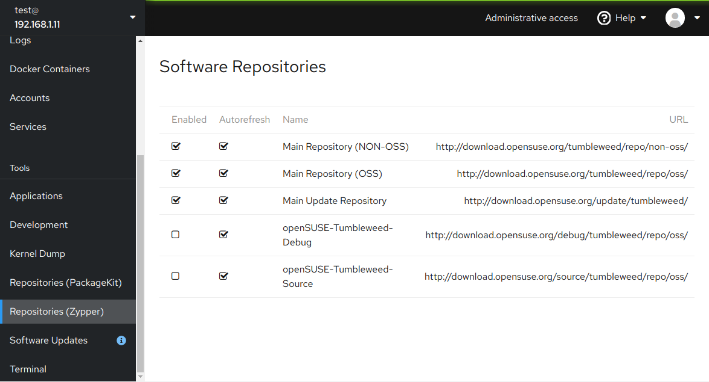

# cockpit-plugins

Experimental plugins for [Cockpit](https://cockpit-project.org/),
just as a proof of concept, not for production use...



## Repository Manager (zypper backend)

A simple repository manager which uses `zypper` command as a backend.

This plugin allows changing the repository status (enabled/disabled) and
the autorefresh flag. Just click the displayed check boxes.

The advantage of the `zypper` backend is that we can get all repository details
and it allows changing all properties.

:warning: *The disadvantage is that it only works in the (open)SUSE distributions!*

## Repository Manager (PackageKit backend)

This is an alternative implementation using the [PackageKit](
https://www.freedesktop.org/software/PackageKit/gtk-doc/index.html)
[DBus API](https://www.freedesktop.org/software/PackageKit/gtk-doc/api-reference.html).

The advantage is that it will work also on non-SUSE Linux distributions.

The disadvantage is that the PackageKit API a quite limited and does not
return all details about the repositories and it cannot fully manage them.
This plugin is currently read-only, it cannot modify the repositories.

## Testing

```shell
git clone https://github.com/lslezak/cockpit-plugins.git
mkdir -p ~/.local/share/cockpit
ln -sf ~/cockpit-plugins/* ~/.local/share/cockpit
```
